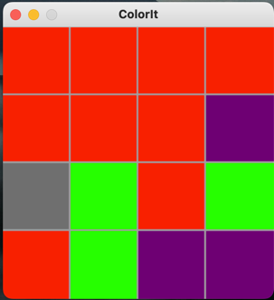

# Developpement d'applications graphiques avec Pythons

## L'horloge  [facile]

En utilisant **tkinter**, réaliser une horloge affichant l'heure dans 3 fuseaux et se mettant à jour toutes les secondes.

> Les composants graphiques possédent la méthode **after** permettant d'executer un traitement apres un temps donnée en millisecondes.  

## Detecteur de langue  [facile]

En utilisant **tkinter**, réaliser une application permettant de déduire la langue du texte inséré.

> Vous pouvez utiliser Les librairies *langdetect* et *langcodes* pour detecter la langue.

## Demineur [difficile]

En s'appuyant sur la librairie *pygame*, développer le jeu mythique de windows 3.1 le fameux démineur.

## Colorit [difficile]

En s'appuyant sur la librairie *pygame*, développer le jeu colorit. 

Ce jeu consiste à trouver la combinaison permettant de remplir le jeu avec la meme couleur. 

Le jeu commence à la 1ere case située en haut à gauche. Le joueur choisit une des cases (horizontale ou vertical) accolée à la 1ere case et qui déterminera 
la prochaine couleur du jeu. Suite à cette action, la 1ere case du jeu ainsi que la case selectionnée passe à la couleur 
selectionnée.

Le second tour, l'utilisateur peut choisir une des cases accolés aux cases de même couleur situés en haut à gauche. 
Et ainsi de suite.

Voici un exemple : 

